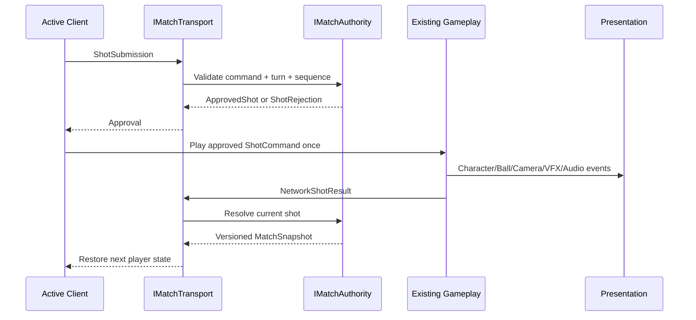

# M12 Online Multiplayer Architecture

## Goals

- 현재 Hole01의 타격, Rigidbody 공 물리, 지형 판정, 카메라, 캐릭터, HUD, VFX, 오디오를 재사용한다.
- 서버/호스트 권한형 턴 모델과 교체 가능한 transport 경계를 만든다.
- 한 프로세스에서 Player A와 simulated remote Player B가 번갈아 플레이하는 Local 2P 검증 경로를 제공한다.
- 매 프레임 Transform 대신 `ShotSubmission`, `ApprovedShot`, `NetworkShotResult`, `MatchSnapshot`을 전달한다.
- 기본 모드는 `OfflineSingle`로 유지한다.

## Non-Goals

- 실제 서버, relay, lobby, matchmaking, authentication, reconnect UI, production SDK 설치는 M12 범위가 아니다.
- Rigidbody 물리의 lockstep determinism 또는 서로 다른 기기의 완전 동일 simulation을 보장하지 않는다.
- 실시간 동시 플레이, spectator, replay, multi-hole match, anti-cheat 완성은 구현하지 않는다.
- 기존 gameplay 계산을 네트워크 계층에서 다시 계산하지 않는다.

## Authority Model

`IMatchAuthority`가 현재 player, turn index, shot sequence, 승인, 결과 적용, 다음 player와 match 완료를 결정한다. 현재 구현은 `LocalMatchAuthority`가 같은 프로세스에서 `MatchAuthorityCore`를 감싼다. 향후 dedicated server/host 구현이 같은 interface를 대체한다.

클라이언트는 원하는 샷을 제출할 수 있지만 승인 전에는 공을 발사할 수 없다. 권한 계층은 match/player/turn/sequence/protocol, 유한 수치, 값 범위, lie별 club을 검증한다. 최종 공 위치와 점수 결과를 현재 로컬 authority가 수락하는 것은 foundation용 신뢰 경계이며 production에서는 서버 계산 또는 서버 검증으로 강화해야 한다.

### State Ownership Matrix

| State | Owner | Replica / Consumer | M12 rule |
| --- | --- | --- | --- |
| Match phase/version | Authority | Session, HUD | snapshot만 적용 |
| Current player/turn index | Authority | Session, input gate, HUD | client 변경 금지 |
| Shot sequence/duplicate history | Authority | Transport/session | 단조 증가, 최근 64개 key 보관 |
| Shot input intent | Active client | Authority | `ShotSubmission`으로만 제출 |
| Approved `ShotCommand` | Authority | Existing ShotFlow | 승인 후 한 번만 재생 |
| Live Rigidbody state | Active simulation | Camera/VFX/audio | frame streaming 없음, lockstep 주장 없음 |
| Final ball/lie/strokes/penalties | Existing gameplay, accepted by Authority | Player snapshot | 결과 적용 후 snapshot 배포 |
| Active visual ball | Presentation/session | Existing scene graph | 현재 player의 논리 상태만 복원 |
| Camera/character/HUD/VFX/audio | Local presentation | 없음 | 네트워크 DTO에 포함하지 않음 |

## Match State

`MatchSnapshot`은 match id, protocol version, monotonic snapshot version, hole id, phase, turn state, turn index, shot sequence, current player와 player snapshots를 가진다. `MatchSnapshotStore`는 다른 match 또는 오래된/equal version을 거절한다. 개발 매치 재시작 시 store를 명시적으로 reset한다.

## Turn State

```text
PreparingShot -> ShotApproved -> ShotPlaying -> ResolvingShot
              -> PreparingShot(next non-holed player)
              -> TurnComplete(all players holed)
```

`RoundRobinTurnOrderPolicy`는 disconnected 또는 holed player를 건너뛴다. 모든 player가 holed이면 phase가 `HoleComplete`가 된다.

## Shot Submission

`ShotSubmission`은 `MatchId`, `MatchPlayerId`, `TurnIndex`, requested sequence, command version, serializable `ShotCommand`을 가진다. 로컬 A와 simulated B 모두 기존 ShotFlow command 생성 경로를 사용한다.

## Shot Approval

`IShotCommitGate`가 single-player와 online approval 경계를 제공한다. `OfflineSingle`은 gate를 우회한다. `LocalTwoPlayer`에서는 `ShotFlowState.AwaitingApproval`로 들어가며 `ApprovedShot`이 돌아오기 전까지 공을 발사하지 않는다.

검증 항목은 match/player/turn/sequence/version, duplicate, NaN/Infinity, 입력/물리 값 범위, Green=Putter와 그 외 lie=Driver 규칙이다.

## Shot Playback

승인된 local A shot은 gate event를 통해 기존 Character impact marker와 ShotFlow를 거쳐 발사된다. remote B shot도 `TryExecuteApprovedShot`을 통해 동일한 Character -> Ball -> Camera/VFX/audio 경로를 사용한다.

## Result Resolution

기존 `HoleFlowController`가 bounce/roll/stop, hazard recovery, strokes, penalties, lie, hole result를 계산하고 `HoleShotResolution` 또는 `HoleCompleted`를 방출한다. Session은 이를 `NetworkShotResult`로 제출하며 authority는 현재 approved shot과 일치하는 결과만 적용한다.

## Snapshot

결과 적용 뒤 authority는 새 version의 `MatchSnapshot`을 배포한다. Session은 최신 version만 적용하고 현재 player의 논리 공 상태를 하나의 visual ball에 복원한다. Snapshot은 reconnect/rejoin의 기반이지만 M12에는 실제 reconnect transport가 없다.

## Player Ball State

각 `PlayerSnapshot`은 Ball Position, Last Valid Position, Lie, Strokes, Penalties, Holed, relative score와 label을 독립적으로 보유한다. 턴 전환 때 기존 ball/progress/club selection에 해당 player 값만 복원한다.

## Local / Remote Input

Player A만 로컬 입력 owner다. A가 아닌 player turn에는 `CanSubmitShot`이 false이며 keyboard/button command와 action button을 막는다. Player B는 개발용 command를 제출하고 approved playback entry point를 사용한다.

## Serialization

`JsonMatchMessageSerializer`는 Unity `JsonUtility` round-trip을 제공한다. DTO는 primitive, enum, string, serializable value type만 사용하며 `UnityEngine.Object`와 scene/presentation reference를 포함하지 않는다. `NetworkVector3`가 Unity `Vector3`와 wire value 사이의 경계다.

## Versioning

M12 protocol version은 `OnlineProtocol.CurrentVersion = 1`이다. Submission과 snapshot은 version을 포함하며 지원하지 않는 submission version은 거절한다. 필드 추가 시 migration 또는 명시적 rejection 정책을 먼저 정의한다.

## Transport Abstraction

`IMatchTransport`는 approved/rejected/snapshot event, shot/result submission, latency 설정, tick, pending cancellation을 제공한다. Gameplay와 presentation은 transport 구현을 알지 못한다.

## Local Loopback

`LocalLoopbackTransport`는 request/response를 JSON serialize/deserialize한 뒤 같은 프로세스의 authority로 전달한다. 0~2000 ms one-way latency와 최대 64 pending message budget을 지원한다. 기본 설정은 OfflineSingle, 0 ms, verbose off이며 메뉴 시뮬레이션은 LocalTwoPlayer, one-way 200 ms다.

## Failure Handling

- Invalid/duplicate/stale submission은 rejection을 반환하고 공을 발사하지 않는다.
- Local rejection은 `AwaitingApproval`에서 이전 조작 가능 state로 복귀한다.
- 오래되거나 다른 match snapshot은 무시한다.
- dependency 또는 surface mapping 누락은 명시적 Console error를 남긴다.
- pending queue는 disable/restart 시 취소한다.
- Retry, timeout UX, disconnect recovery는 production transport 과제다.

## Security Boundary

클라이언트 command를 신뢰하지 않고 authority가 구조와 범위를 검증한다. 그러나 M12 local authority는 client가 제출한 최종 결과의 물리적 타당성을 재연산하지 않는다. Production에서는 authoritative simulation/result validation, rate limit, authenticated player binding, replay protection을 추가해야 한다.

## Reconnect Foundation

Stable match/player id, snapshot version, per-player ball state, turn/sequence가 reconnect에 필요한 최소 상태를 만든다. 실제 reconnect에는 latest snapshot 요청, pending submission reconciliation, idempotency window, timeout/forfeit policy가 필요하다.

## Presentation Separation

`MultiplayerTurnPresenter`는 snapshot을 읽어 turn/score만 표현한다. `MultiplayerDebugOverlay`는 F2 개발 telemetry다. Authority/transport DTO에는 UI, camera, character, VFX, audio가 없고 presentation은 기존 gameplay event에 반응한다.

## Future Production Transport

Production transport는 `IMatchTransport`를 구현하고 실제 client/server envelope, reliable delivery, disconnect/reconnect, authentication binding, server clock, observability를 제공한다. SDK 선택과 설치는 M12 이후 별도 결정이다.



## Online Risks

- Rigidbody 결과는 기기/프레임/플랫폼 사이에서 deterministic하지 않다.
- 현재 final result trust는 치팅과 조작 방지에 충분하지 않다.
- Packet loss, reorder, retry, reconnect, host migration은 구현되지 않았다.
- Snapshot conflict 정책은 단일 authority를 전제로 한다.
- 64개 duplicate history는 foundation용 bounded window다.
- 실제 두 기기와 WAN에서는 아직 검증하지 않았다.
- 개인정보, 인증 token, 운영 logging, moderation 정책은 범위 밖이다.
