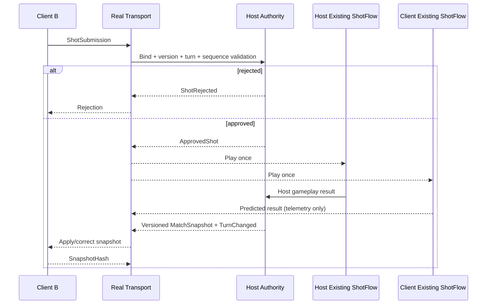

# M13 Real Network Transport Architecture

## Goals

- Connect two independent SwingPop processes over a real localhost UDP socket.
- Preserve the M12 `IMatchTransport`, authority, DTO, approval gate, duplicate protection, snapshot, and per-player state boundaries.
- Make the host authoritative for player assignment, turn approval, gameplay simulation result, and snapshots.
- Reuse the existing ShotFlow → Character → Ball → HoleFlow → Camera/HUD/VFX/Audio path on both screens.
- Keep `OfflineSingle` as the default and retain `LocalTwoPlayer` as a no-socket regression mode.

## Non-Goals

- Relay/NAT traversal, Internet discovery, lobby, matchmaking, accounts, reconnect, host migration, dedicated servers, multi-hole sessions, rollback, and Rigidbody lockstep are not M13 features.
- M13 does not claim LAN or WAN verification.
- M13 does not stream Rigidbody transforms every frame.
- M13 does not provide production security or a final online UI.

## SDK / Transport Decision

The project uses the official Unity Transport package. Unity 6000.5.7f1 resolves the editor-built-in package as `com.unity.transport 6.5.0`; that exact version is recorded in `Packages/manifest.json` and `packages-lock.json`. Netcode for GameObjects was not added because M12 already defines the match protocol and needs only a low-level adapter.

`UnityTransportMatchTransport` implements `IMatchTransport`. `LocalLoopbackTransport` remains intact for M12 development and regression. Large reliable messages use `FragmentationPipelineStage` followed by `ReliableSequencedPipelineStage`, plus an application envelope limit of 64KB.

## Host Model

The host listens on a configured address/port, accepts one client, binds that connection to Player B, owns `LocalMatchAuthority`, and starts the match only after the handshake. It validates submissions, begins approved playback once, simulates every approved shot through existing gameplay, resolves the host gameplay result, then broadcasts a versioned snapshot and turn change.

Additional/late connections are rejected in this one-client prototype. The host is Player A. A disconnected session does not silently accept stale callbacks, and the listener can be started again after cleanup.

## Client Model

The client connects to the host and sends `ClientHello`. It never chooses its own player ID. It receives Player B from `PlayerAssigned`, waits for `MatchStarted`, and can submit only when the authoritative snapshot says it is Player B's turn.

Approved shots enter the existing ShotFlow exactly once. Client physics is presentation/prediction only. `PredictedShotResult` is optional telemetry and never changes host state.

## Connection Flow

```text
Host: Starting -> Listening -> Handshaking -> Connected -> InMatch
Client: Starting -> Connecting -> Handshaking -> Connected -> InMatch
Both: InMatch -> Disconnecting/Disconnected, or Failed on timeout/error
```

The handshake timeout is Inspector-configurable from 5–10 seconds (default 8 seconds). Restart resets driver, connection handle, sequence guard, player binding, pending state, and telemetry required for a fresh connection.

## Player Assignment

`ConnectionPlayerRegistry` is host-owned. The accepted Unity Transport connection handle is bound to stable `player-b`. The host rejects a `ShotSubmission.PlayerId` that differs from the binding with `PlayerSpoofing`. Player A is local to the host and is never assigned by the client.

## Message Envelope

Every wire message has `protocolVersion`, `messageType`, `matchId`, monotonic `sequence`, and JSON `payload` fields.

Protocol version is 2 because adding a real envelope and connection handshake is a breaking change from the M12 protocol-1 loopback format. Version mismatch, stale/duplicate envelope sequence, malformed data, and payloads over 64KB are rejected before gameplay dispatch.

Messages implemented: `ClientHello`, `PlayerAssigned`, `MatchStarted`, `ShotSubmission`, `ShotApproved`, `ShotRejected`, `Snapshot`, `SnapshotHash`, `TurnChanged`, `PredictedShotResult`, `Ping`, `Pong`, and `DisconnectNotice`.

## Reliable Messaging

Match messages use Unity Transport's reliable sequenced pipeline. Fragmentation is placed before reliability as required by Unity Transport for large reliable payloads. The application sends event/state messages only; there is no per-frame transform stream. Ping/Pong provides development RTT telemetry.

## Shot Submission

The active local player creates the existing serializable `ShotCommand`. `MatchSessionController` wraps it in `ShotSubmission` with match, player, turn, requested shot sequence, and protocol version. `IShotCommitGate` holds ShotFlow in `AwaitingApproval`, so no ball launch occurs before an approval.

## Host Approval

The host reuses `MatchAuthorityCore` checks for match, player, turn, turn state, shot sequence, duplicate key, protocol, finite/ranged command values, and lie-specific club. The transport adds connection-to-player binding, envelope sequence, payload, protocol, and a basic eight-submissions-per-second guard.

An accepted command advances to `ShotPlaying` once and is sent as `ApprovedShot`. A rejection contains a stable `ShotRejectReason` and returns the local UI to a usable aiming state.

## Authoritative Simulation

M13 uses Option A: the host plays every approved command through the existing Character/ShotFlow/Ball/HoleFlow graph. Only the resulting host `HoleShotResolution` or `HoleCompleted` can call `ResolveShot` and mutate authoritative player state. Client result messages are never trusted for match state.

## Client Playback

Both host and client receive the same approved command and use the existing presentation path. Local approved shots resume the waiting commit; remote approved shots enter `TryExecuteApprovedShot`. Duplicate approval cannot launch a second ball because both authority sequencing and ShotFlow's state guard reject it.

## Result Correction

There is no rollback in M13. When the host settles or completes the shot, its snapshot replaces the client's predicted ball/lie/stroke/penalty state. Correction happens at the result/snapshot boundary, not by per-frame Rigidbody corrections.

## Snapshot Sync

Snapshots carry protocol, monotonic version, phase, turn, shot sequence, current player, and both players' ball/lie/stroke/penalty/holed data. `MatchSnapshotStore` rejects another match, equal version, or older version. On a preparing turn, existing Ball and HoleFlow state are restored from the current player's snapshot.

The client acknowledges each applied snapshot with a stable FNV-1a snapshot hash. Host telemetry compares it with the local authoritative hash.

## Desync Detection

F2 shows local/remote snapshot hashes and mismatch count. Optional predicted-result telemetry compares final position, lie, stroke, and penalty. Position difference over 0.25m, or a categorical mismatch, emits `[M13][Desync]`. This is diagnostic only and cannot mutate authority.

## Disconnect

Shutdown sends a notice, flushes the disconnect datagram, clears binding/sequence state, disposes the driver, and removes stale connection handles. UTP inactivity timeout is eight seconds by default. M13 detects disconnect and supports a clean listener restart, but it does not reconnect a player to an existing match.

## Security Boundary

M13 is not production-security complete. It has host-side player binding, command/range/turn/version validation, stale sequence rejection, duplicate shot rejection, payload cap, basic rate limiting, and host-owned results.

Still required: account authentication, session tokens, TLS/encryption policy, hardened anti-replay/rate limiting, dedicated authoritative simulation, broader server validation, abuse/audit policy, privacy controls, and DDoS protection.

## Build / Launch

Development build output (ignored by Git): `Builds/M13/SwingPopM13.exe`.

```powershell
# Host
Builds/M13/SwingPopM13.exe -swingpopHost -swingpopPort=7777

# Client
Builds/M13/SwingPopM13.exe -swingpopClient -swingpopAddress=127.0.0.1 -swingpopPort=7777
```

Editor menus:

- `SwingPop > Online > Build M13 Network Prototype`
- `SwingPop > Online > Validate M13 Network Prototype`
- `SwingPop > Online > M13 > Start Host`
- `SwingPop > Online > M13 > Start Client`
- `SwingPop > Online > M13 > Build Development Prototype`

## Production Gaps

Relay/NAT, Lobby, Matchmaking, Authentication, Reconnect, Dedicated Authority, Multi-hole lifecycle, secure deployment, persistence, host migration, real WAN/LAN soak tests, loss/jitter simulation, and production monitoring remain future work. See `docs/TODO_ONLINE.md`.

## Message Flow Diagram


